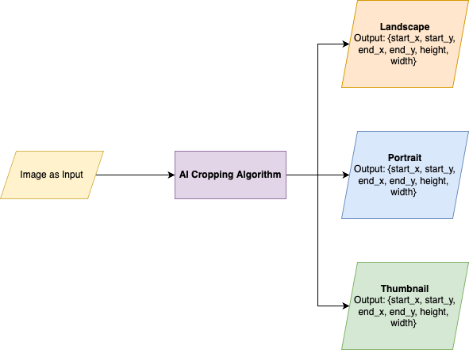
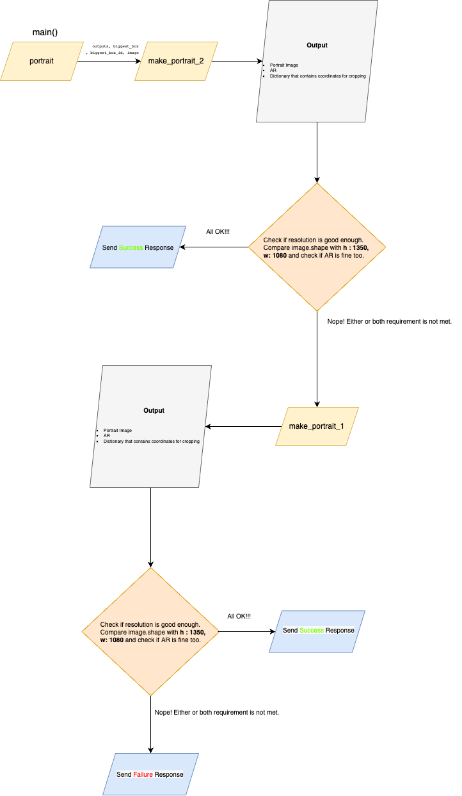

Before you begin :
### [Detectron2 has not released pre-built binaries for the latest pytorch](https://github.com/facebookresearch/detectron2/issues/4053), so we install from source instead.

pip install 'git+https://github.com/facebookresearch/detectron2.git'

pip install pyyaml==5.1

## 1. Introduction

A project that makes content peeps life slightly easier by automating one aspect of their tasks. And that task involves cropping images into three modes, 1) Landscape 2) Portrait 3) Thumbnail and also fulfilling their respective aspect ratio requirements.

## 2. Requirements that needs to be fulfilled

| **Image Format/Mode**  | **Desired AR**  | **Min Allowed Image Size *(H, W)*** |
| :------------: |:---------------:| :---:|
| Landscape     | 1.78      |   (1080, 1920)   |
| Portrait      | 0.8       |   (1350, 1080)   |
| Thumbnail     | 1.0       |    (720, 720)    |

## 3. Implementation

### 3.1 High Level (Non-technical)

How does the algorithm decide where and what to crop in the image? How does it make sure it crops in a manner that meets the requirements and also looks good enough? By good enough we mean, the prominent or salient regions of the image are not affected.
The basic idea behind this smart algorithm is to use a person detection model (specifically, Pose estimation models, Ref 3.2) to center a crop around the most interesting region. In our case, till now, as all the images that we are gonna deal with are person/player images, the most interesting region will be the person/player themselves.

### 3.2 Deep Learning Models used

There’s only one model that is used: The keypoint Pose model of [Facebook’s Detectron2](https://github.com/facebookresearch/detectron2). Its model config is :
[COCO-Keypoints/keypoint_rcnn_X_101_32x8d_FPN_3x.yaml](https://github.com/facebookresearch/detectron2/blob/main/configs/COCO-Keypoints/keypoint_rcnn_X_101_32x8d_FPN_3x.yaml)

After thorough R&D and experimentation with different models on a small dataset of cherry-picked high resolution images, we decided to go forward with Facebook’s Detectron2. The metric used for model assessment was the model's inference time rather than accuracy as high accuracy was not critical for our use case.

### 3.3 Technical Implementation

Right now, there are two approaches that have been devised and are currently active. Later on, one will be opted for deployment after much testing and comparison.

The basic input/output structure of the algorithm is described below in the Fig 1.0,

Fig 1.0

In Fig 1.0, the AI Cropping Algorithm has been depicted as a black box. Therefore, let's peek inside it.  The main function responsibility is in three-tier and thus performs three major tasks in sequence (Note: there are more things that are performed in the main function but have been left out in this section to make it pertinent and less confusing),

1. When the image has been read using cv2 library, the image is then sent to the predictor which returns **model_outputs**. This output contains some meta data and output data (e.g, predicted boxes, predicted keypoints, etc.)

2. By using the **model_outputs** that we just got, we then find the biggest bound box out of all the ones that have been detected by the model. You must ask why is this so? Why the biggest bounding box? Well, we rely on the assumption that, the main subject in the image, or the prominent subject around which the crop will be made will relatively be larger. Therefore, the bounding box for that subject should be the largest.

3. Now, the main part of the algorithm comes into action using the data *model_outputs,  biggest bounding box, image* and is explained in the subsections.

#### 3.3.1 First Approach

In this approach, each mode has its respective method *(make_landscape, make_portrait, make_thumbnail)*.

1. **Landscape**
 This is probably the simplest one. Take the whole width of the image. And then using the formula to calculate aspect ratio,  $$ar = width/height$$, make height the subject as it is unknown and this is what we want to calculate.

2. **Portrait**
  This is slightly challenging than others. We have implemented a hybrid solution for this.
It will be quite confusing to explain in mere words, therefore, a flowchart will help in this.

  Fig 2.0

3. **Thumbnail**
    This also involves two versions. One that is based on the portrait’s output. As a thumbnail only requires images to be of the same height and width, the portrait image can be made as a thumbnail by simply deducting the height of the portrait image by the difference (Math.abs(height-width)). The other version implements the cropping logic from scratch by calculating the radius (same as in the first version of portrait logic). The priority is given to the first version and is therefore run first. If it fails for whatever reason, the second is run.

#### 3.3.2 Second Approach

 This approach is more simple, efficient, and concise than its counterpart. It also seems to work better than its predecessor. The coordinates that it uses are similar to the first approach. It takes the mean of right and left shoulders and takes the Y value of it. For X, it calculates the midpoint of the biggest bounding box and takes the X value of it. The crop generation method takes the image, the coordinates and image format enum (Landscape, Portrait, Thumbnail) as arguments. Based on the enumeration value, the target aspect ratio is determined. The image ratio is calculated using the image shape field, $$image ratio = image.height / image.width.$$ Then depending on which ratio is bigger, the cropping action is executed appropriately. If the image ratio is larger than the target ratio, we squeeze the image vertically, and vice versa.

Please note that, for the ImageFormarAR enumeration, the aspect ratio hardcoded for respective image modes are inverse/reciprocal. E.g, for landscape, it's 0.56. If we divide 1 by 0.56, it's 1.78. The reason is, the ratios that are calculated (image ratio and target ratio) in this approach, are calculated the other way around, i.e, $$height/width$$ instead of $$width/height$$

 The `fit_window()` method calculates the start and end values. The very values based on which the image will be cropped. This method also makes sure that these values do not exceed the maximum image size (that is, image height or width) or go lower than the minimum image value (that is, 0).

### 3.4 Validation Checks and Safeguards

Although, we have utmost trust in the content guys that they won’t try this with images that do not have any person/player in them, or images in which the subjects (i.e, humans) are small, but no one can be too trustworthy. Therefore, we have put **some** safeguards in place that are executed initially to make sure that the image that is uploaded is fine. There are only a handful of checks (2 right now). We leave the rest to the user himself/herself. And even if the image is a problematic one, that would cause the algorithm to produce egregious output, the user himself/herself would then assess it by trying out the values returned. If not contempt, let him do it manually :hammer_and_pick:. If contempt, awesome! 🚀 This endeavor would hardly waste a user’s time.

1. The first check detects if there is any person detected in the image. If this check returns false, we do not proceed further and send a failure response back to the user, with the message, “No person was detected! Wrong image maybe.”

2. The second subsequent check makes sure the predicted bounding boxes are not too small. Note: A box is classified to be small if its area is less than 10% of the image area. If this check returns true, it means all boxes are too small and we do not proceed further and send a failure response back to the user, with the message, "All the detected humans in the image are too small; implying that the main subject is not in the image".

## 4. Cases where the algorithm might fail

There are some images for which the algorithm does not work as expected. Here we list down the types of image for which the algorithm works best and worst:

| Image Context  | ✅ or ❌  |
| :------------: |:---------------:|
| Image contains single subject     | :white_check_mark: |
| Image contains multiple subjects but the main one is a lot bigger  | :white_check_mark: |
| Atleast half body is visible     | :white_check_mark:   |
 | Multiple subjects, all approx same height  (e.g, celebration)   | :x: |
| Upper 1/3rd of the body (e.g, face only)     | :x:  |

